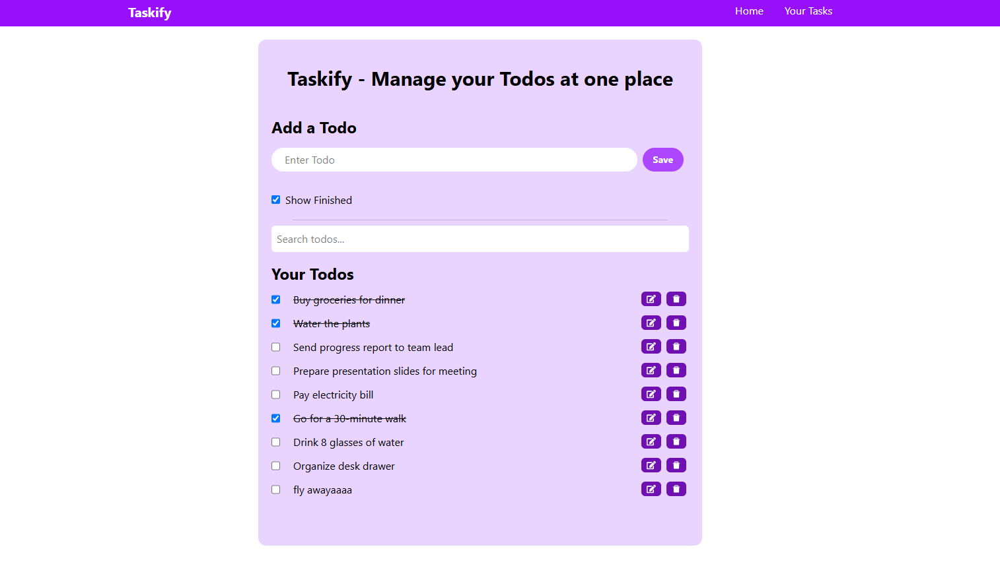

# Taskify - Todo Management Application

A simple todo application built with React.

## Features

- Add new todos (must be more than 3 characters)
- Mark todos as complete or incomplete
- Edit todos by clicking the edit button
- Delete todos that you don't need
- Search through your todos
- Hide or show completed todos
- Saves your todos even when you close the browser
- Works seamlessly on desktop and mobile devices

## How to run this project

1. Download or clone this project
2. Open terminal in the project folder
3. Run `npm install` to install dependencies
4. Run `npm run dev` to start the app
5. Open your browser and go to the URL shown in terminal

## What I learned building this

- How to use React hooks (useState, useEffect)
- How to create custom hooks for reusable logic
- How to handle forms and user input
- How to store data in browser's localStorage
- How to use Tailwind CSS for styling
- How to break code into smaller components

## Technologies used

- React
- Tailwind CSS
- React Icons
- UUID (Generate unique identifiers for todos)
- Vite (for building the project)

## Screenshot

---